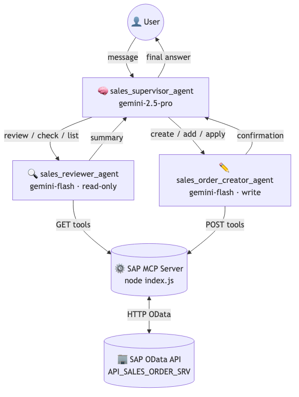
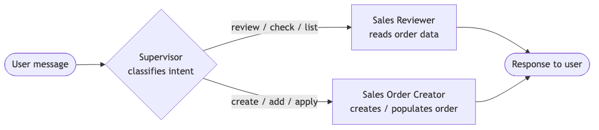
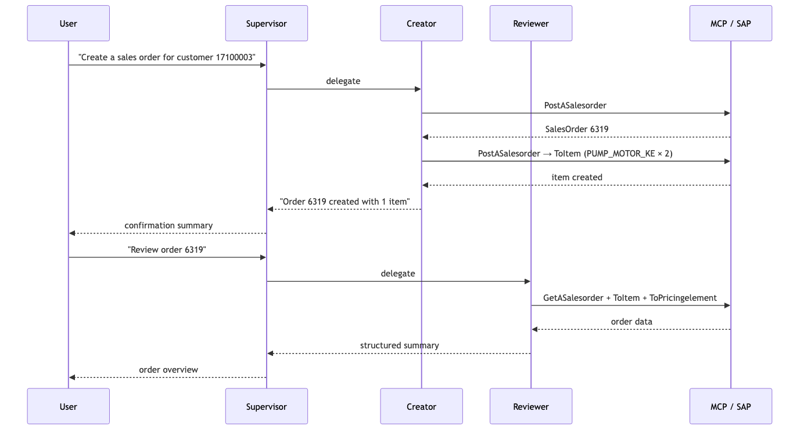

# SAP O2C Agent

A conversational agent that creates and reviews SAP sales orders. You talk to it in plain English; it figures out whether to read or write and calls the right SAP OData endpoints through an MCP server.

<picture>
  <source media="(prefers-color-scheme: dark)" srcset="docs/diagrams/architecture-dark.png">
  
</picture>

There are three agents under the hood. A **supervisor** (Gemini 2.5 Pro) reads your message and decides which sub-agent to call. The **reviewer** (Gemini Flash) has access to all the `GET` endpoints and returns summaries. The **creator** (Gemini Flash) has access to the `POST` endpoints and handles new orders. Each sub-agent gets its own isolated MCP process, so the reviewer can never accidentally write data and the creator never reads stale state on its own.

<picture>
  <source media="(prefers-color-scheme: dark)" srcset="docs/diagrams/routing-dark.png">
  
</picture>

---

## Setup

You need Python ≥ 3.9, Node.js ≥ 18, and a Gemini API key.

**1. Install the Python package**

```bash
cd adk/O2C
python -m venv .venv && source .venv/bin/activate
pip install -e .
```

**2. Set your environment variables**

Copy `.env.example` to `.env` and fill in your values:

| Variable | What to put here |
|----------|-----------------|
| `GOOGLE_API_KEY` | Your Gemini API key |
| `BASIC_USERNAME_BASICAUTH` | SAP username |
| `BASIC_PASSWORD_BASICAUTH` | SAP password |
| `API_BASE_URL` | e.g. `http://your-sap-host:50000/sap/opu/odata/sap/API_SALES_ORDER_SRV/` |
| `MCP_SERVER_JS` | Absolute path to `generated/API_SALES_ORDER_SRV/build/index.js` |

**3. Build the MCP server**

```bash
cd generated/API_SALES_ORDER_SRV
npm install && npm run build
```

**4. Start the agent**

```bash
cd adk/O2C
adk run o2c_agent
```

---

## How to use it

Once the agent is running, just type what you want. Some examples:

```
> Review sales order 6319
> Create a sales order for customer 17100003
> Add 2 units of PUMP_MOTOR_KE (plant 1710) to order 6319
> Apply a 5% discount to order 6319
> What's the delivery status on order 6319?
```

The supervisor reads your message, picks the right sub-agent, and streams back the result.

### Creating a sales order end-to-end

Here's what a full create-and-review flow looks like:

**1.** Ask the agent to create an order. The minimum it needs is sales org, distribution channel, division, and a sold-to party:

```
> Create a sales order: sales org 1710, distribution channel 10, division 00, sold-to 17100003
```

The creator calls `PostASalesorder` and reports back the new order number (e.g. **6319**).

**2.** Add a line item:

```
> Add material PUMP_MOTOR_KE, quantity 2 PC, plant 1710 to order 6319
```

Unit price is 835 USD, so the order total becomes **1,670 USD**.

**3.** Apply pricing conditions:

```
> Apply a 5% customer discount and a 25 USD freight charge to order 6319
```

The creator posts two rows to `ToPricingelement` — condition types `K007` and `KF00`.

**4.** Review the finished order:

```
> Review order 6319
```

The reviewer fetches the header, line items, and pricing elements and returns a plain-English summary.

<picture>
  <source media="(prefers-color-scheme: dark)" srcset="docs/diagrams/sequence-dark.png">
  
</picture>

---

## Regenerating the MCP server

The MCP server in `generated/API_SALES_ORDER_SRV/` is generated from the OpenAPI spec in `sap_api/`. If SAP updates the API or you want to point at a different service, regenerate it with:

```bash
openapi-mcp-generator \
  --input  ./sap_api/API_SALES_ORDER_SRV.json \
  --output ./generated/API_SALES_ORDER_SRV \
  --server-name API_SALES_ORDER_SRV \
  --base-url http://<your-sap-host>:50000/sap/opu/odata/sap/API_SALES_ORDER_SRV/
```

Then rebuild: `cd generated/API_SALES_ORDER_SRV && npm run build`.

The reviewer only gets the `Get*` tools; the creator only gets the `Post*` tools. That's controlled by the `tool_filter` list in `adk/O2C/o2c_agent/agent.py`.

### Available tools per agent

| SAP resource | Reviewer | Creator |
|---|:-:|:-:|
| Sales order header | GET | POST |
| Line items | GET | POST |
| Partners | GET | POST |
| Pricing elements | GET | POST |
| Header texts | GET | POST |
| Billing plan | GET | POST |
| Payment plan details | GET | POST |
| Preceding process flow doc | GET | — |
| Related objects | GET | POST |
| Subsequent process flow doc | GET | — |

<details>
<summary>Full tool list (all <code>API_SALES_ORDER_SRV</code> endpoints)</summary>

```
GetASalesorder
PostASalesorder
GetASalesorder___salesorder___
DeleteASalesorder___salesorder___
PatchASalesorder___salesorder___
GetASalesorder___salesorder___ToBillingplan
GetASalesorder___salesorder___ToItem
PostASalesorder___salesorder___ToItem
GetASalesorder___salesorder___ToPartner
PostASalesorder___salesorder___ToPartner
GetASalesorder___salesorder___ToPaymentplanitemdetails
PostASalesorder___salesorder___ToPaymentplanitemdetails
GetASalesorder___salesorder___ToPrecedingprocflowdoc
GetASalesorder___salesorder___ToPricingelement
PostASalesorder___salesorder___ToPricingelement
GetASalesorder___salesorder___ToRelatedobject
PostASalesorder___salesorder___ToRelatedobject
GetASalesorder___salesorder___ToSubsequentprocflowdoc
GetASalesorder___salesorder___ToText
PostASalesorder___salesorder___ToText
GetASalesorderbillingplan
GetASalesorderbillingplan_salesorder___salesorder___billingplan___billingplan___
PatchASalesorderbillingplan_salesorder___salesorder___billingplan___billingplan___
GetASalesorderbillingplan_salesorder___salesorder___billingplan___billingplan___ToBillingplanitem
PostASalesorderbillingplan_salesorder___salesorder___billingplan___billingplan___ToBillingplanitem
GetASalesorderbillingplan_salesorder___salesorder___billingplan___billingplan___ToSalesorder
GetASalesorderbillingplanitem
PostASalesorderbillingplanitem
GetASalesorderbillingplanitem_salesorder___salesorder___billingplan___billingplan___billingplanitem___billingplanitem___
DeleteASalesorderbillingplanitem_salesorder___salesorder___billingplan___billingplan___billingplanitem___billingplanitem___
PatchASalesorderbillingplanitem_salesorder___salesorder___billingplan___billingplan___billingplanitem___billingplanitem___
GetASalesorderbillingplanitem_salesorder___salesorder___billingplan___billingplan___billingplanitem___billingplanitem___ToBillingplan
GetASalesorderbillingplanitem_salesorder___salesorder___billingplan___billingplan___billingplanitem___billingplanitem___ToSalesorder
GetASalesorderheaderpartner
PostASalesorderheaderpartner
GetASalesorderheaderpartner_salesorder___salesorder___partnerfunction___partnerfunction___
DeleteASalesorderheaderpartner_salesorder___salesorder___partnerfunction___partnerfunction___
PatchASalesorderheaderpartner_salesorder___salesorder___partnerfunction___partnerfunction___
GetASalesorderheaderpartner_salesorder___salesorder___partnerfunction___partnerfunction___ToAddress
GetASalesorderheaderpartner_salesorder___salesorder___partnerfunction___partnerfunction___ToSalesorder
GetASalesorderheaderprelement
PostASalesorderheaderprelement
GetASalesorderheaderprelement_salesorder___salesorder___pricingprocedurestep___pricingprocedurestep___pricingprocedurecounter___pricingprocedurecounter___
DeleteASalesorderheaderprelement_salesorder___salesorder___pricingprocedurestep___pricingprocedurestep___pricingprocedurecounter___pricingprocedurecounter___
PatchASalesorderheaderprelement_salesorder___salesorder___pricingprocedurestep___pricingprocedurestep___pricingprocedurecounter___pricingprocedurecounter___
GetASalesorderheaderprelement_salesorder___salesorder___pricingprocedurestep___pricingprocedurestep___pricingprocedurecounter___pricingprocedurecounter___ToSalesorder
GetASalesorderitem
PostASalesorderitem
GetASalesorderitem_salesorder___salesorder___salesorderitem___salesorderitem___
DeleteASalesorderitem_salesorder___salesorder___salesorderitem___salesorderitem___
PatchASalesorderitem_salesorder___salesorder___salesorderitem___salesorderitem___
GetASalesorderitem_salesorder___salesorder___salesorderitem___salesorderitem___ToBillingplan
GetASalesorderitem_salesorder___salesorder___salesorderitem___salesorderitem___ToPartner
PostASalesorderitem_salesorder___salesorder___salesorderitem___salesorderitem___ToPartner
GetASalesorderitem_salesorder___salesorder___salesorderitem___salesorderitem___ToPrecedingprocflowdocitem
GetASalesorderitem_salesorder___salesorder___salesorderitem___salesorderitem___ToPricingelement
PostASalesorderitem_salesorder___salesorder___salesorderitem___salesorderitem___ToPricingelement
GetASalesorderitem_salesorder___salesorder___salesorderitem___salesorderitem___ToRelatedobject
PostASalesorderitem_salesorder___salesorder___salesorderitem___salesorderitem___ToRelatedobject
GetASalesorderitem_salesorder___salesorder___salesorderitem___salesorderitem___ToSalesorder
GetASalesorderitem_salesorder___salesorder___salesorderitem___salesorderitem___ToScheduleline
PostASalesorderitem_salesorder___salesorder___salesorderitem___salesorderitem___ToScheduleline
GetASalesorderitem_salesorder___salesorder___salesorderitem___salesorderitem___ToSubsequentprocflowdocitem
GetASalesorderitem_salesorder___salesorder___salesorderitem___salesorderitem___ToText
PostASalesorderitem_salesorder___salesorder___salesorderitem___salesorderitem___ToText
GetASalesorderitembillingplan
GetASalesorderitembillingplan_salesorder___salesorder___salesorderitem___salesorderitem___billingplan___billingplan___
PatchASalesorderitembillingplan_salesorder___salesorder___salesorderitem___salesorderitem___billingplan___billingplan___
GetASalesorderitembillingplan_salesorder___salesorder___salesorderitem___salesorderitem___billingplan___billingplan___ToBillingplanitem
PostASalesorderitembillingplan_salesorder___salesorder___salesorderitem___salesorderitem___billingplan___billingplan___ToBillingplanitem
GetASalesorderitembillingplan_salesorder___salesorder___salesorderitem___salesorderitem___billingplan___billingplan___ToSalesorder
GetASalesorderitembillingplan_salesorder___salesorder___salesorderitem___salesorderitem___billingplan___billingplan___ToSalesorderitem
GetASalesorderitempartner
PostASalesorderitempartner
GetASalesorderitempartner_salesorder___salesorder___salesorderitem___salesorderitem___partnerfunction___partnerfunction___
DeleteASalesorderitempartner_salesorder___salesorder___salesorderitem___salesorderitem___partnerfunction___partnerfunction___
PatchASalesorderitempartner_salesorder___salesorder___salesorderitem___salesorderitem___partnerfunction___partnerfunction___
GetASalesorderitempartner_salesorder___salesorder___salesorderitem___salesorderitem___partnerfunction___partnerfunction___ToAddress
GetASalesorderitempartner_salesorder___salesorder___salesorderitem___salesorderitem___partnerfunction___partnerfunction___ToSalesorder
GetASalesorderitempartner_salesorder___salesorder___salesorderitem___salesorderitem___partnerfunction___partnerfunction___ToSalesorderitem
GetASalesorderitempartneraddress
GetASalesorderitempartneraddress_salesorder___salesorder___salesorderitem___salesorderitem___partnerfunction___partnerfunction___addressrepresentationcode___addressrepresentationcode___
PatchASalesorderitempartneraddress_salesorder___salesorder___salesorderitem___salesorderitem___partnerfunction___partnerfunction___addressrepresentationcode___addressrepresentationcode___
GetASalesorderitempartneraddress_salesorder___salesorder___salesorderitem___salesorderitem___partnerfunction___partnerfunction___addressrepresentationcode___addressrepresentationcode___ToPartner
GetASalesorderitempartneraddress_salesorder___salesorder___salesorderitem___salesorderitem___partnerfunction___partnerfunction___addressrepresentationcode___addressrepresentationcode___ToSalesorder
GetASalesorderitempartneraddress_salesorder___salesorder___salesorderitem___salesorderitem___partnerfunction___partnerfunction___addressrepresentationcode___addressrepresentationcode___ToSalesorderitem
GetASalesorderitemprelement
PostASalesorderitemprelement
GetASalesorderitemprelement_salesorder___salesorder___salesorderitem___salesorderitem___pricingprocedurestep___pricingprocedurestep___pricingprocedurecounter___pricingprocedurecounter___
DeleteASalesorderitemprelement_salesorder___salesorder___salesorderitem___salesorderitem___pricingprocedurestep___pricingprocedurestep___pricingprocedurecounter___pricingprocedurecounter___
PatchASalesorderitemprelement_salesorder___salesorder___salesorderitem___salesorderitem___pricingprocedurestep___pricingprocedurestep___pricingprocedurecounter___pricingprocedurecounter___
GetASalesorderitemprelement_salesorder___salesorder___salesorderitem___salesorderitem___pricingprocedurestep___pricingprocedurestep___pricingprocedurecounter___pricingprocedurecounter___ToSalesorder
GetASalesorderitemprelement_salesorder___salesorder___salesorderitem___salesorderitem___pricingprocedurestep___pricingprocedurestep___pricingprocedurecounter___pricingprocedurecounter___ToSalesorderitem
GetASalesorderitemrelatedobject
PostASalesorderitemrelatedobject
GetASalesorderitemrelatedobject_salesorder___salesorder___salesorderitem___salesorderitem___sddocrelatedobjectsequencenmbr___sddocrelatedobjectsequencenmbr___
DeleteASalesorderitemrelatedobject_salesorder___salesorder___salesorderitem___salesorderitem___sddocrelatedobjectsequencenmbr___sddocrelatedobjectsequencenmbr___
GetASalesorderitemrelatedobject_salesorder___salesorder___salesorderitem___salesorderitem___sddocrelatedobjectsequencenmbr___sddocrelatedobjectsequencenmbr___ToSalesorder
GetASalesorderitemrelatedobject_salesorder___salesorder___salesorderitem___salesorderitem___sddocrelatedobjectsequencenmbr___sddocrelatedobjectsequencenmbr___ToSalesorderitem
GetASalesorderitemtext
PostASalesorderitemtext
GetASalesorderitemtext_salesorder___salesorder___salesorderitem___salesorderitem___language___language___longtextid___longtextid___
DeleteASalesorderitemtext_salesorder___salesorder___salesorderitem___salesorderitem___language___language___longtextid___longtextid___
PatchASalesorderitemtext_salesorder___salesorder___salesorderitem___salesorderitem___language___language___longtextid___longtextid___
GetASalesorderitemtext_salesorder___salesorder___salesorderitem___salesorderitem___language___language___longtextid___longtextid___ToSalesorder
GetASalesorderitemtext_salesorder___salesorder___salesorderitem___salesorderitem___language___language___longtextid___longtextid___ToSalesorderitem
GetASalesorderitmprecdgprocflow
GetASalesorderitmprecdgprocflow_salesorder___salesorder___salesorderitem___salesorderitem___docrelationshipuuid_guid__docrelationshipuuid___
GetASalesorderitmprecdgprocflow_salesorder___salesorder___salesorderitem___salesorderitem___docrelationshipuuid_guid__docrelationshipuuid___ToSalesorder
GetASalesorderitmprecdgprocflow_salesorder___salesorder___salesorderitem___salesorderitem___docrelationshipuuid_guid__docrelationshipuuid___ToSalesorderitem
GetASalesorderitmsubsqntprocflow
GetASalesorderitmsubsqntprocflow_salesorder___salesorder___salesorderitem___salesorderitem___docrelationshipuuid_guid__docrelationshipuuid___
GetASalesorderitmsubsqntprocflow_salesorder___salesorder___salesorderitem___salesorderitem___docrelationshipuuid_guid__docrelationshipuuid___ToSalesorder
GetASalesorderitmsubsqntprocflow_salesorder___salesorder___salesorderitem___salesorderitem___docrelationshipuuid_guid__docrelationshipuuid___ToSalesorderitem
GetASalesorderpartneraddress
GetASalesorderpartneraddress_salesorder___salesorder___partnerfunction___partnerfunction___addressrepresentationcode___addressrepresentationcode___
PatchASalesorderpartneraddress_salesorder___salesorder___partnerfunction___partnerfunction___addressrepresentationcode___addressrepresentationcode___
GetASalesorderpartneraddress_salesorder___salesorder___partnerfunction___partnerfunction___addressrepresentationcode___addressrepresentationcode___ToPartner
GetASalesorderpartneraddress_salesorder___salesorder___partnerfunction___partnerfunction___addressrepresentationcode___addressrepresentationcode___ToSalesorder
GetASalesorderprecdgprocflow
GetASalesorderprecdgprocflow_salesorder___salesorder___docrelationshipuuid_guid__docrelationshipuuid___
GetASalesorderprecdgprocflow_salesorder___salesorder___docrelationshipuuid_guid__docrelationshipuuid___ToSalesorder
GetASalesorderrelatedobject
PostASalesorderrelatedobject
GetASalesorderrelatedobject_salesorder___salesorder___sddocrelatedobjectsequencenmbr___sddocrelatedobjectsequencenmbr___
DeleteASalesorderrelatedobject_salesorder___salesorder___sddocrelatedobjectsequencenmbr___sddocrelatedobjectsequencenmbr___
GetASalesorderrelatedobject_salesorder___salesorder___sddocrelatedobjectsequencenmbr___sddocrelatedobjectsequencenmbr___ToSalesorder
GetASalesorderscheduleline
PostASalesorderscheduleline
GetASalesorderscheduleline_salesorder___salesorder___salesorderitem___salesorderitem___scheduleline___scheduleline___
DeleteASalesorderscheduleline_salesorder___salesorder___salesorderitem___salesorderitem___scheduleline___scheduleline___
PatchASalesorderscheduleline_salesorder___salesorder___salesorderitem___salesorderitem___scheduleline___scheduleline___
GetASalesordersubsqntprocflow
GetASalesordersubsqntprocflow_salesorder___salesorder___docrelationshipuuid_guid__docrelationshipuuid___
GetASalesordersubsqntprocflow_salesorder___salesorder___docrelationshipuuid_guid__docrelationshipuuid___ToSalesorder
GetASalesordertext
PostASalesordertext
GetASalesordertext_salesorder___salesorder___language___language___longtextid___longtextid___
DeleteASalesordertext_salesorder___salesorder___language___language___longtextid___longtextid___
PatchASalesordertext_salesorder___salesorder___language___language___longtextid___longtextid___
GetASalesordertext_salesorder___salesorder___language___language___longtextid___longtextid___ToSalesorder
GetASlsorderitembillingplanitem
PostASlsorderitembillingplanitem
GetASlsorderitembillingplanitem_salesorder___salesorder___salesorderitem___salesorderitem___billingplan___billingplan___billingplanitem___billingplanitem___
DeleteASlsorderitembillingplanitem_salesorder___salesorder___salesorderitem___salesorderitem___billingplan___billingplan___billingplanitem___billingplanitem___
PatchASlsorderitembillingplanitem_salesorder___salesorder___salesorderitem___salesorderitem___billingplan___billingplan___billingplanitem___billingplanitem___
GetASlsorderitembillingplanitem_salesorder___salesorder___salesorderitem___salesorderitem___billingplan___billingplan___billingplanitem___billingplanitem___ToBillingplan
GetASlsorderitembillingplanitem_salesorder___salesorder___salesorderitem___salesorderitem___billingplan___billingplan___billingplanitem___billingplanitem___ToSalesorder
GetASlsorderitembillingplanitem_salesorder___salesorder___salesorderitem___salesorderitem___billingplan___billingplan___billingplanitem___billingplanitem___ToSalesorderitem
GetASlsordpaymentplanitemdetails
PostASlsordpaymentplanitemdetails
GetASlsordpaymentplanitemdetails_salesorder___salesorder___paymentplanitem___paymentplanitem___
DeleteASlsordpaymentplanitemdetails_salesorder___salesorder___paymentplanitem___paymentplanitem___
PatchASlsordpaymentplanitemdetails_salesorder___salesorder___paymentplanitem___paymentplanitem___
GetASlsordpaymentplanitemdetails_salesorder___salesorder___paymentplanitem___paymentplanitem___ToSalesorder
PostRejectapprovalrequest
PostReleaseapprovalrequest
```

</details>

---

> See [adk/O2C/readme.md](adk/O2C/readme.md) for the full agent prompts.

